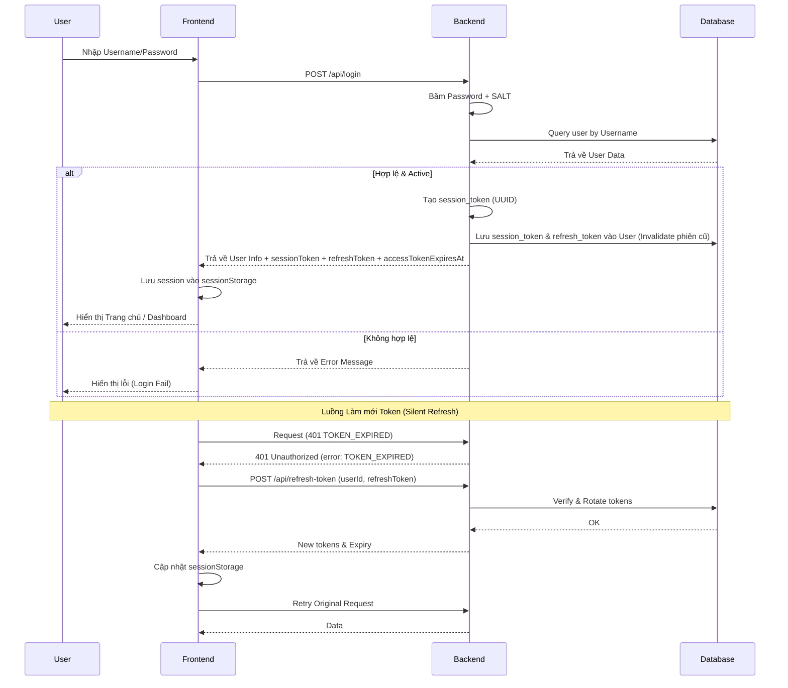
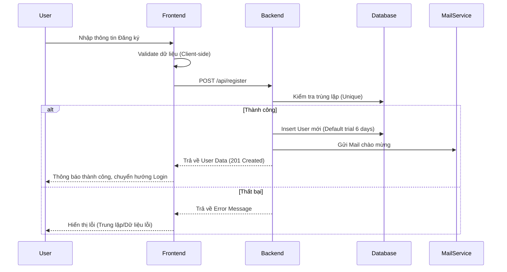
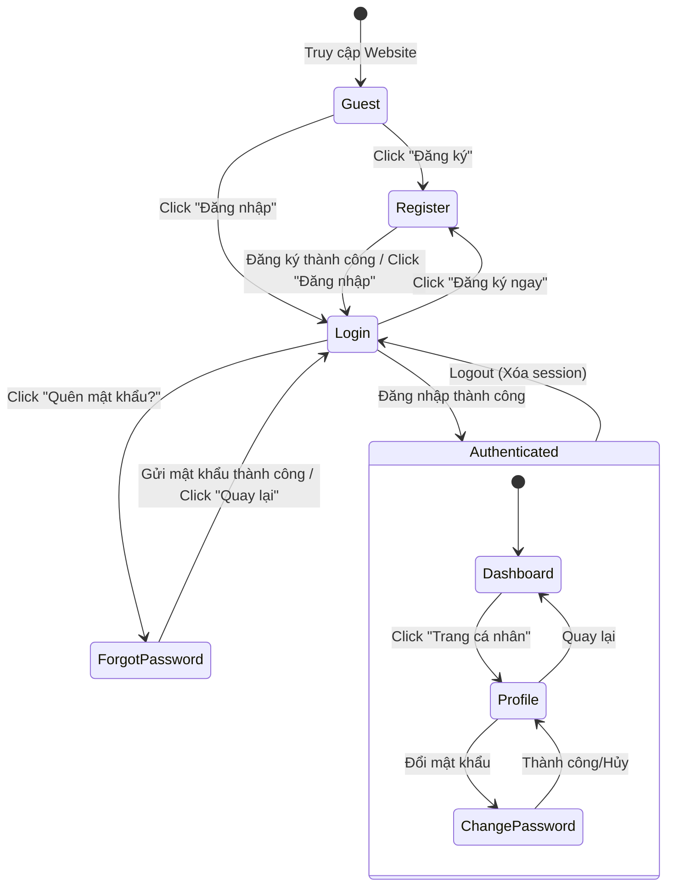

# Thiết kế chi tiết - Chức năng Xác thực (Detail Design - Auth)

Tài liệu này mô tả chi tiết thiết kế cho hệ thống xác thực và quản lý người dùng trong ứng dụng **Smart Learn**.

## 1. Danh sách các hạng mục (Features List)

| STT | Hạng mục | Mô tả |
| :-- | :--- | :--- |
| 1 | **Đăng ký (Registration)** | Tạo tài khoản mới với các trường: Username, Email, Password, Cấp học. |
| 2 | **Đăng nhập (Login)** | Xác thực người dùng bằng Username và Password. Kiểm tra trạng thái `is_active`. |
| 3 | **Khôi phục mật khẩu** | Gửi mật khẩu ngẫu nhiên mới tới Email người dùng đăng ký. |
| 4 | **Quản lý Phiên (Session)** | Sử dụng `session_token` và `X-User-Id` để duy trì đăng nhập (Data Isolation). |
| 5 | **Đổi mật khẩu** | Cho phép người dùng hoặc Admin cập nhật mật khẩu mới. |
| 6 | **Hồ sơ cá nhân (Profile)** | Hiển thị và cập nhật thông tin: Tên hiển thị, Ảnh đại diện, Cấp học. |
| 7 | **Quản trị người dùng (Admin)** | Admin có quyền xem danh sách, tạo mới, chỉnh sửa, xóa hoặc khóa (Lock) tài khoản. |
| 8 | **Gói dùng thử (Trial)** | Tự động kích hoạt 6 ngày dùng thử (Gói Miễn phí) cho mọi tài khoản mới. |
| 9 | **Refresh Token** | Token duy trì phiên đăng nhập (30 ngày) và cơ chế xoay vòng (Rotation) mỗi lần cấp lại Access Token. |

---

## 2. Danh sách Validate (Validation List)

### 2.1. Phía Frontend
- **Username**: Không được để trống.
- **Email**: Phải đúng định dạng email (regex), không được để trống.
- **Mật khẩu**: Tối thiểu 6 ký tự.
- **Xác nhận mật khẩu**: Phải trùng khớp với mật khẩu đã nhập.
- **Cấp học**: Chọn từ danh sách có sẵn (Tiểu học, THCS, THPT, Đại học, Khác).

### 2.2. Phía Backend
- **Unique Constraint**: Kiểm tra Username và Email không được trùng lặp trong Database.
- **Authentication**: Password được băm bằng SHA-256 kèm SALT (`hvui-salt-2024`) trước khi so khớp.
- **Authorization**:
    - `is_active`: Nếu `false`, từ chối đăng nhập.
    - `session_token`: Phải trùng khớp với token lưu trong DB (ngăn chặn đăng nhập đồng thời ở nhiều nơi).
    - **Token Expiration**: Access Token có thời hạn **1 ngày**. Refresh Token có thời hạn **30 ngày**.
    - **Token Rotation**: Mỗi khi dùng Refresh Token để lấy Access Token mới, hệ thống sẽ cấp một Refresh Token mới đồng thời vô hiệu hóa cái cũ.
    - **Admin check**: Một số API (`GET /api/users`, `DELETE /api/users`) yêu cầu người dùng phải có `role = 'admin'`.

---

## 3. Danh sách Message (Message List)

| Mã lỗi/Trạng thái | Nội dung thông báo (Tiếng Việt) |
| :--- | :--- |
| **Login Success** | "Chào mừng, [Tên hiển thị]!" |
| **Login Fail (Wrong)** | "Tên đăng nhập hoặc mật khẩu không chính xác." |
| **Login Fail (Active)** | "Tài khoản của bạn đã bị khóa." |
| **Session Expired** | "Phiên đăng nhập đã hết hạn hoặc bạn đã đăng nhập ở thiết bị/trình duyệt khác." |
| **Token Expired** | "TOKEN_EXPIRED" (Sử dụng Refresh Token để làm mới Access Token). |
| **Register Success** | "Đăng ký thành công! Vui lòng đăng nhập." |
| **Register Duplicate** | "Tên đăng nhập hoặc email đã tồn tại." |
| **Validation Error** | "Vui lòng điền đầy đủ thông tin." / "Mật khẩu xác nhận không khớp." |
| **Forgot PW Success** | "Mật khẩu mới đã được gửi vào Email. Truy cập vào Email đăng ký để lấy mật khẩu mới." |
| **Forgot PW Fail** | "Email không tồn tại trong hệ thống." |

---

## 4. Danh sách API (API Endpoints)

| Method | Endpoint | Quyền hạn | Mô tả |
| :--- | :--- | :--- | :--- |
| `POST` | `/api/register` | Public | Đăng ký tài khoản mới. |
| `POST` | `/api/login` | Public | Đăng nhập và nhận `sessionToken`, `refreshToken`, `accessTokenExpiresAt`. |
| `POST` | `/api/refresh-token` | Public | Sử dụng `refreshToken` để lấy bộ token mới (Xoay vòng). |
| `POST` | `/api/forgot-password` | Public | Yêu cầu khôi phục mật khẩu qua Email. |
| `GET` | `/api/me` | User | Lấy thông tin tài khoản hiện tại (Profile). |
| `GET` | `/api/users` | Admin | Lấy danh sách toàn bộ người dùng. |
| `POST` | `/api/users` | Admin | Admin tạo tài khoản thủ công. |
| `PUT` | `/api/users/:id` | Admin/Self | Cập nhật thông tin profile/trạng thái. |
| `PUT` | `/api/users/:id/password` | Admin/Self | Cập nhật mật khẩu mới. |
| `DELETE` | `/api/users/:id` | Admin | Xóa tài khoản (Trừ tài khoản root admin). |

---

## 5. Flow Diagram (Luồng chức năng)

### 5.1. Luồng Đăng nhập (Login Flow)

### 5.2. Luồng Đăng ký (Register Flow)

### 5.3. Luồng liên kết giữa các chức năng (Feature Navigation Flow)
Sơ đồ dưới đây mô tả cách người dùng di chuyển giữa các màn hình và trạng thái của chức năng Auth.

---

## 6. Case sử dụng (Usecases)

### UC-01: Người dùng đăng ký tài khoản
- **Actor**: Người dùng mới.
- **Mục tiêu**: Có tài khoản để sử dụng các tính năng cá nhân hóa.
- **Kết quả**: Tài khoản được tạo, có 6 ngày dùng thử, nhận được email chào mừng.

### UC-02: Người dùng đăng nhập
- **Actor**: Người dùng đã có tài khoản.
- **Mục tiêu**: Truy cập vào hệ thống.
- **Kết quả**: Được cấp Token, truy cập được dữ liệu riêng tư (Subjects, Lessons).

### UC-03: Người dùng khôi phục mật khẩu
- **Actor**: Người dùng quên mật khẩu.
- **Mục tiêu**: Lấy lại quyền truy cập tài khoản.
- **Kết quả**: Nhận mật khẩu mới qua Email cá nhân.

### UC-04: Admin quản lý người dùng
- **Actor**: Quản trị viên (Role: admin).
- **Mục tiêu**: Kiểm soát người dùng trên hệ thống.
- **Tính năng**: Khóa tài khoản vi phạm, gia hạn gói cước, hỗ trợ đổi mật khẩu.

### UC-05: Cập nhật Hồ sơ (Profile)
- **Actor**: Người dùng/Admin.
- **Mục tiêu**: Thay đổi thông tin hiển thị hoặc ảnh đại diện.
- **Kết quả**: Thông tin mới được lưu và hiển thị trên giao diện Header/Profile.
