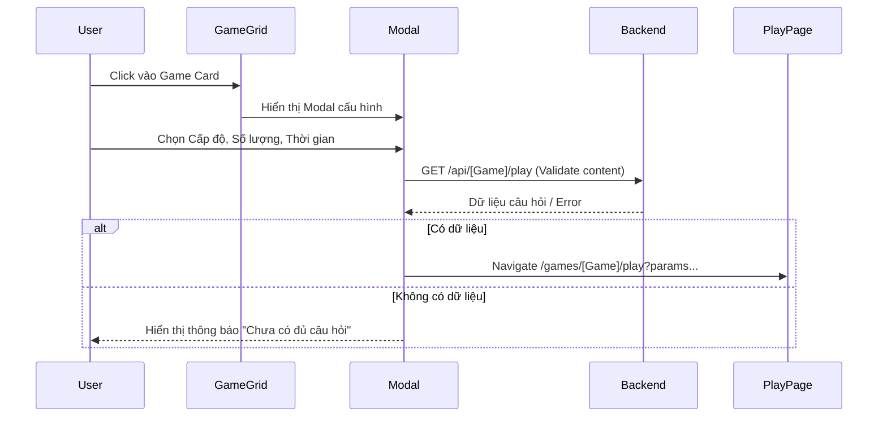
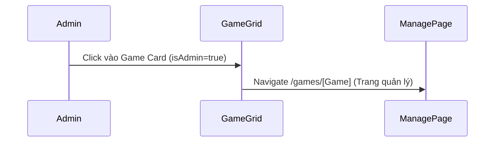

# Thiết kế chi tiết - Chức năng Game tại Trang chủ (Detail Design - Home Game)

Tài liệu này mô tả chi tiết thiết kế cho hệ thống hiển thị và cấu hình trò chơi tại màn hình trang chủ trong ứng dụng **Smart Learn**.

## 1. Danh sách các hạng mục (Features List)

| STT | Hạng mục | Mô tả |
| :-- | :--- | :--- |
| 1 | **Lưới Game (Game Grid)** | Hiển thị danh sách các trò chơi dưới dạng card (Icon, Tên, Mô tả ngắn). |
| 2 | **Phân quyền truy cập** | Admin: Click vào game sẽ chuyển đến trang quản lý nội dung. User: Click vào game sẽ mở Modal cấu hình chơi. |
| 3 | **Modal Vua tiếng Việt** | Chọn Cấp độ (Dễ, TB, Khó, Cực khó), Số lượng câu hỏi (5-30) và Thời gian (1-15 phút). |
| 4 | **Modal Chép chính tả** | Chọn Cấp độ (Dễ, TB, Khó, Cực khó) và Ngôn ngữ (Vi, En, Ja). |
| 5 | **Modal Đuổi hình bắt chữ** | Chọn Cấp độ, Số lượng câu hỏi (5-30) và Thời gian chơi (1-15 phút). |
| 6 | **Modal Ca dao tục ngữ** | Chọn Cấp độ, Số lượng câu hỏi và Thời gian chơi. |
| 7 | **Modal Học cùng bé** | Load danh sách chủ đề (Categories) từ server. Chọn 1 chủ đề để bắt đầu bài học hình ảnh. |
| 8 | **Modal Nhanh như chớp** | Chọn Cấp độ, Số lượng câu hỏi và Thời gian chơi. Có validate dữ liệu trước khi vào chơi. |
| 9 | **Hiệu ứng giao diện** | Hiệu ứng Hover card, Animation Fade-in/Scale-in cho Modal, màu sắc đại diện cho từng game. |

---

## 2. Danh sách Validate (Validation List)

### 2.1. Khởi tạo Game
- **Yêu cầu nội dung**: Trước khi chuyển sang màn hình chơi, hệ thống gọi API `play` với `limit=1` để kiểm tra xem có ít nhất 1 câu hỏi phù hợp với cấu hình hay không.
- **Thông báo**: Nếu không có câu hỏi, hiển thị alert/message báo lỗi và không chuyển trang.

### 2.2. Cấu hình Modal
- **Số lượng câu hỏi**: Mặc định từ 5 đến 30.
- **Thời gian**: Mặc định từ 1 đến 15 phút.
- **Ngôn ngữ**: Phải thuộc danh sách hỗ trợ (Vi, En, Ja).

---

## 3. Danh sách Message (Message List)

| Mã lỗi/Trạng thái | Nội dung thông báo (Tiếng Việt) |
| :--- | :--- |
| **No questions error** | "Chưa có đủ câu hỏi phù hợp với lựa chọn này. Vui lòng thử cấp độ khác." |
| **Load categories fail** | "Không thể tải danh sách chủ đề." |
| **Empty categories** | "Hiện chưa có bài học nào sẵn sàng. Vui lòng quay lại sau nhé!" |
| **Game Init Fail** | "Không thể khởi tạo trò chơi. Vui lòng thử lại sau." |
| **Coming soon** | "Tính năng [Tên Game] sắp ra mắt!" |

---

## 4. Danh sách API (API Endpoints)

| Method | Endpoint | Mô tả |
| :--- | :--- | :--- |
| `GET` | `/api/vuatiengviet/play?level=...&limit=...` | Lấy danh sách câu hỏi Vua tiếng Việt. |
| `GET` | `/api/dictation/random?level=...&language=...` | Kiểm tra và lấy bài chép chính tả ngẫu nhiên. |
| `GET` | `/api/pictogram/play?level=...&limit=...` | Lấy danh sách câu hỏi Đuổi hình bắt chữ. |
| `GET` | `/api/proverbs/play?level=...&limit=...` | Lấy danh sách câu hỏi Ca dao tục ngữ. |
| `GET` | `/api/learning/categories` | Lấy danh sách chủ đề cho game Học cùng bé. |
| `GET` | `/api/nhanhnhuchop/play?level=...&limit=...` | Lấy danh sách câu hỏi Nhanh như chớp. |

---

## 5. Flow Diagram (Luồng chức năng)

### 5.1. Luồng Khởi tạo trò chơi (User)

### 5.2. Luồng Điều hướng Admin

---

## 6. Database Schema (Tổng quan)

Mỗi trò chơi được quản lý bởi các bảng riêng biệt nhưng có cấu trúc chung bao gồm:
- **Questions Table**: `question`, `answer`/`correct_index`, `level`, `image_url` (nếu có).
- **History/Result Table**: Lưu điểm số, thời gian hoàn thành của người dùng (tùy game).

---

## 7. Case sử dụng (Usecases)

### UC-01: Học sinh bắt đầu chơi "Nhanh như chớp"
- **Actor**: Học sinh.
- **Mô tả**: Học sinh muốn thử thách phản xạ với game Nhanh như chớp cấp độ Khó trong 5 phút.
- **Hành động**: Click Game "Nhanh như chớp" → Chọn "Khó" → Chọn "5 phút" → Click "Chơi ngay".
- **Kết quả**: Hệ thống kiểm tra kho câu hỏi khó, nếu có sẽ chuyển sang màn hình chơi với đồng hồ đếm ngược 300s.

### UC-02: Admin quản lý nội dung "Đuổi hình bắt chữ"
- **Actor**: Admin.
- **Mô tả**: Admin muốn thêm câu hỏi mới cho game Đuổi hình bắt chữ.
- **Hành động**: Đăng nhập Admin → Màn hình Game → Click "Đuổi hình bắt chữ" → Chuyển sang `/games/pictogram` → Click "Thêm câu hỏi".
- **Kết quả**: Giao diện quản lý hiển thị, cho phép upload ảnh và nhập đáp án.

### UC-03: Chọn chủ đề trong "Học cùng bé"
- **Actor**: Phụ huynh/Học sinh.
- **Mô tả**: Chọn kho từ vựng "Động vật" để học qua hình ảnh.
- **Hành động**: Click "Học cùng bé" → Modal hiện danh sách chủ đề → Chọn "Động vật (20 hình ảnh)" → Click "Chơi ngay".
- **Kết quả**: Hệ thống load toàn bộ hình ảnh của chủ đề Động vật và vào trang hiển thị flashcard hình ảnh.
