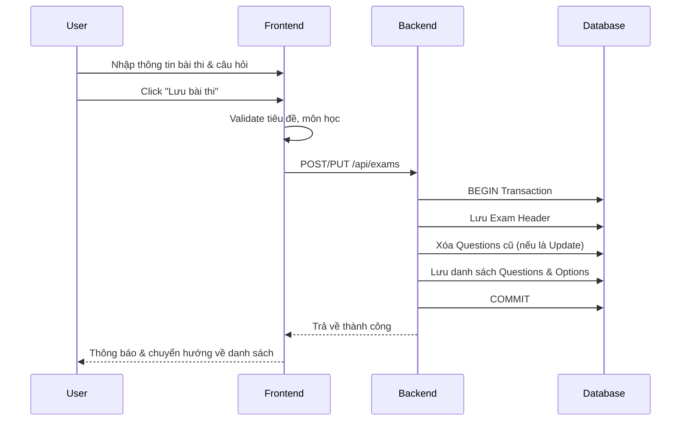
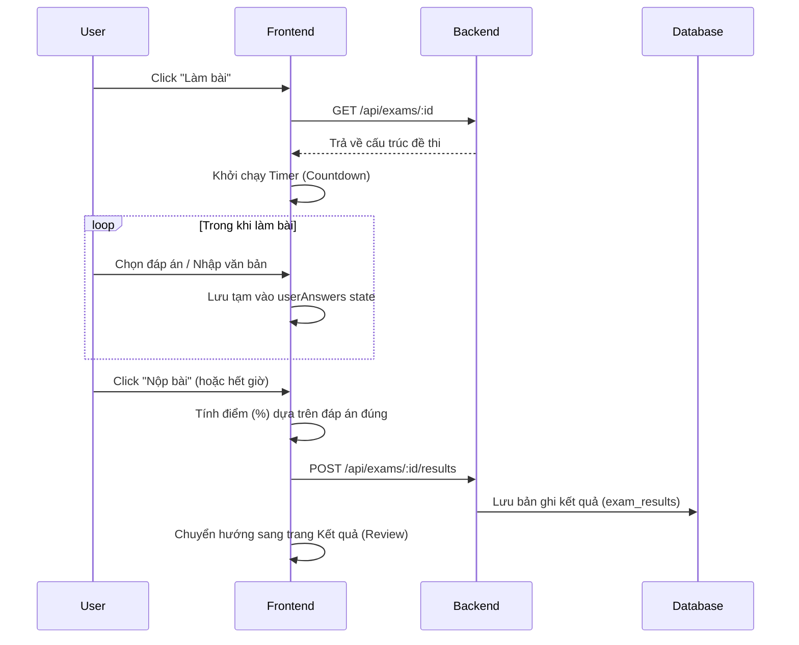
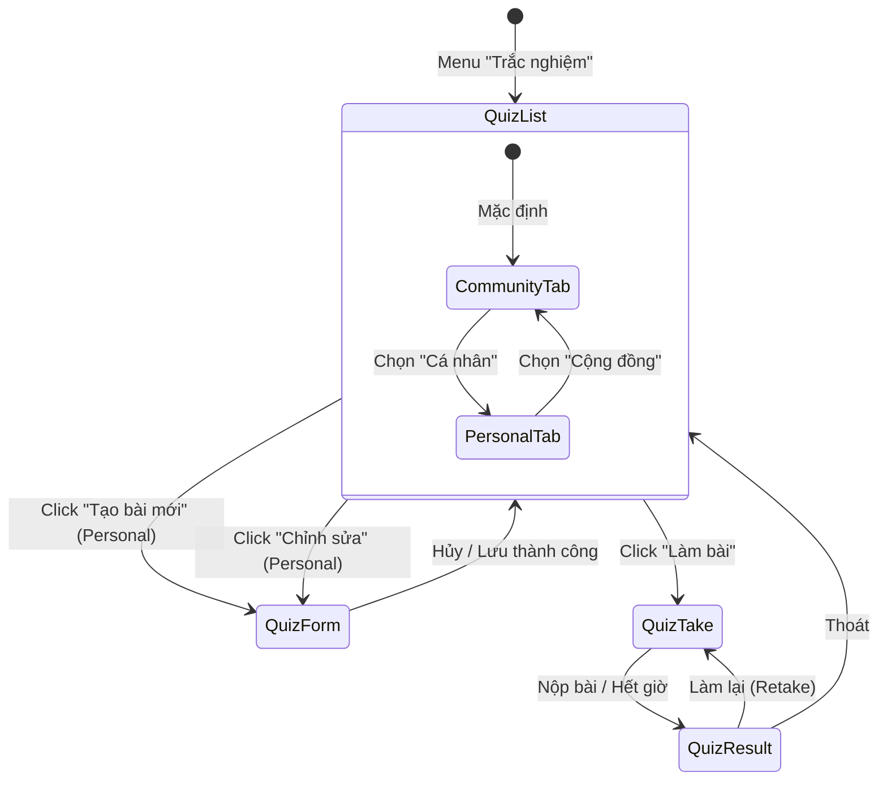

# Thiết kế chi tiết - Chức năng Trắc nghiệm (Detail Design - Quiz)

Tài liệu này mô tả chi tiết thiết kế cho hệ thống quản lý và thực hiện bài thi trắc nghiệm trong ứng dụng **Smart Learn**.

## 1. Danh sách các hạng mục (Features List)

| STT | Hạng mục | Mô tả |
| :-- | :--- | :--- |
| 1 | **Quản lý danh sách** | Hiển thị bài thi theo 2 tab: Cá nhân (của tôi) và Cộng đồng (công khai). |
| 2 | **Soạn thảo bài thi** | Form tạo mới/chỉnh sửa với các thông tin: Tiêu đề, Mô tả, Thời gian (phút), Môn học, Cấp độ, Lớp, Chế độ công khai. |
| 3 | **Trình quản lý câu hỏi** | Thêm/Xóa/Sắp xếp câu hỏi. Hỗ trợ 3 loại: Single Choice, Multiple Choice, và Text Input. |
| 4 | **Import/Export Excel** | Cho phép tải file mẫu và nhập hàng loạt câu hỏi từ file Excel (.xlsx). |
| 5 | **Thực hiện làm bài** | Giao diện làm bài với đồng hồ đếm ngược, thanh điều hướng câu hỏi và tự động nộp bài khi hết giờ. |
| 6 | **Kết quả & Chấm điểm** | Tính điểm theo tỷ lệ phần trăm (%), lưu lịch sử làm bài và hiển thị điểm trung bình trên thẻ bài thi. |
| 7 | **Phân quyền & Tầm nhìn** | Tùy chọn Công khai (Is Public) hoặc Riêng tư. Lọc nội dung cộng đồng theo cấp học của User. |

---

## 2. Danh sách Validate (Validation List)

### 2.1. Tạo/Sửa bài thi (Quiz Form)
- **Tiêu đề**: Không được để trống.
- **Môn học**: Bắt buộc phải chọn môn học từ danh sách.
- **Thời gian**: Phải là số dương (mặc định 30 phút).
- **Câu hỏi**:
    - Nội dung câu hỏi: Nếu để trống sẽ được hệ thống mặc định là "Câu hỏi không tên".
    - Lựa chọn: Các ô lựa chọn rỗng sẽ bị tự động loại bỏ.
    - Với loại `single` hoặc `multiple`: Phải có ít nhất 1 phương án được đánh dấu là "đúng".
    - Với loại `text`: Đáp án đúng là chuỗi văn bản không trống.

### 2.2. Làm bài thi (Quiz Taking)
- **Thời gian**: Khi đếm ngược về 0, hệ thống tự động gọi hàm `handleSubmit`.
- **Nộp bài**: Cảnh báo người dùng khi chưa hoàn thành tất cả câu hỏi.

---

## 3. Danh sách Message (Message List)

| Mã lỗi/Trạng thái | Nội dung thông báo (Tiếng Việt) |
| :--- | :--- |
| **Save Success** | "Đã tạo bài thi thành công" / "Đã cập nhật bài thi" |
| **Save Fail** | "Vui lòng nhập tên bài thi" / "Vui lòng chọn môn học" |
| **Submit Success** | "Đã nộp bài thành công" |
| **Delete Confirm** | "Bạn có chắc chắn muốn xóa bài thi này?" |
| **Delete Success** | "Đã xóa bài thi" |
| **Import Success** | "Đã nhập thành công [N] câu hỏi" |
| **Import Fail** | "File không có dữ liệu câu hỏi" / "Định dạng file không hợp lệ" |

---

## 4. Danh sách API (API Endpoints)

| Method | Endpoint | Mô tả |
| :--- | :--- | :--- |
| `GET` | `/api/exams` | Lấy danh sách bài thi (Filter theo User và Public). |
| `GET` | `/api/exams/:id` | Lấy chi tiết bài thi bao gồm danh sách câu hỏi và các lựa chọn. |
| `POST` | `/api/exams` | Tạo mới bài thi (Lưu đồng thời Exam, Questions, Options). |
| `PUT` | `/api/exams/:id` | Xóa các câu hỏi cũ và ghi đè dữ liệu mới cho bài thi. |
| `DELETE` | `/api/exams/:id` | Xóa bài thi (Cơ sở dữ liệu tự động xóa Questions nhờ ON DELETE CASCADE). |
| `POST` | `/api/exams/:id/results` | Lưu kết quả làm bài của User (điểm số, thời gian làm bài). |

---

## 5. Flow Diagram (Luồng chức năng)

### 5.1. Luồng Tạo/Chỉnh sửa bài thi

### 5.2. Luồng Làm bài và Nộp bài

---

## 6. Luồng liên kết giữa các màn hình (Navigation Flow)

---

## 7. Case sử dụng (Usecases)

### UC-01: Giáo viên/Người dùng tạo đề thi
- **Mô tả**: Người dùng muốn tạo một bài kiểm tra để tự ôn luyện hoặc chia sẻ cho cộng đồng.
- **Hành động**: Soạn câu hỏi thủ công hoặc sử dụng tính năng Import từ Excel để tiết kiệm thời gian.

### UC-02: Học sinh luyện tập trắc nghiệm
- **Mô tả**: Tìm kiếm các bài thi trong tab Cộng đồng.
- **Hành động**: Làm bài dưới áp lực thời gian (Timer), nộp bài và xem ngay giải thích cho các câu sai.

### UC-03: Quản lý thư viện cá nhân
- **Mô tả**: Chỉnh sửa nội dung hoặc thay đổi trạng thái Công khai/Riêng tư của các bài thi đã tạo.
- **Hành động**: Xóa các bài thi cũ hoặc cập nhật điểm lớp/môn học.
