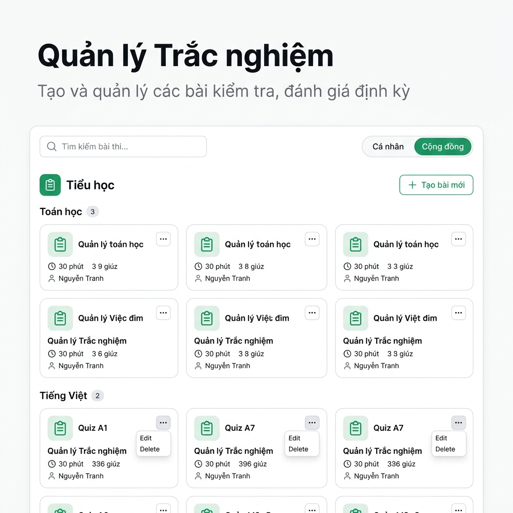
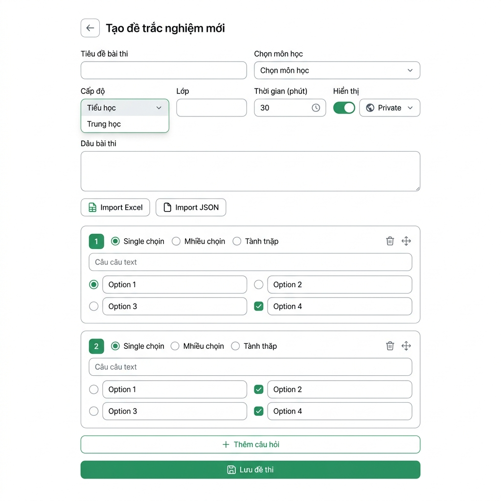
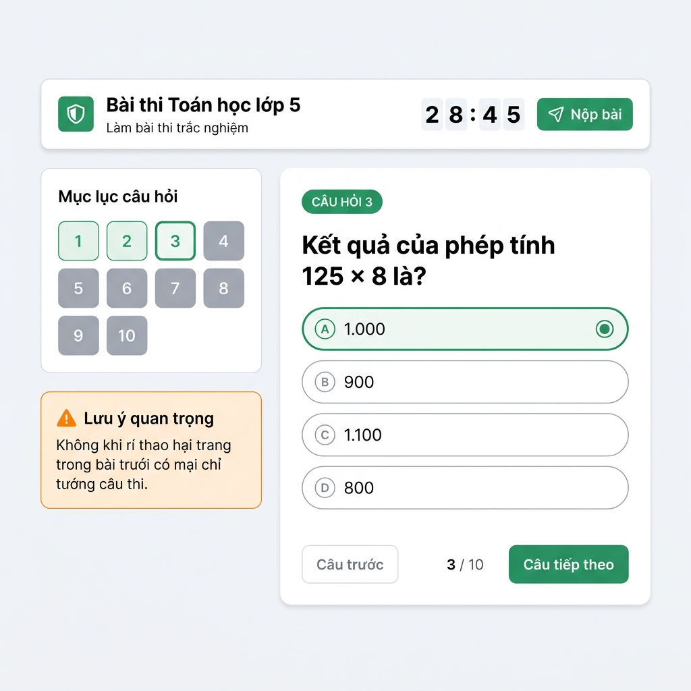

# Smart Learn — Quiz Screens (Figma Mockup)

Tài liệu này tổng hợp các mockup giao diện cho nhóm chức năng **Trắc nghiệm (Quiz)** của ứng dụng Smart Learn.

---

## 1. Màn hình Danh sách Bài thi (QuizListPage)



### Thành phần giao diện

| # | Element | Chi tiết |
|---|---------|----------|
| 1 | Heading | "Quản lý Trắc nghiệm" — text-3xl bold |
| 2 | Subtitle | "Tạo và quản lý các bài kiểm tra, đánh giá định kỳ" — gray muted |
| 3 | Search Bar | Icon Search + input "Tìm kiếm bài thi...", rounded-xl, border-2 |
| 4 | View Toggle | Pill toggle 2 tab: **Cá nhân** / **Cộng đồng**. Active = green #2D9B63 bg + white text |
| 5 | Create Button | "+ Tạo bài mới" — rounded-full, green outline (chỉ hiện ở tab Cá nhân) |
| 6 | Level Header | Icon Layers + Tên cấp học (VD: "Tiểu học") — text-2xl bold green, border-b |
| 7 | Subject Group | Tên môn học + divider + badge đếm số bài thi |
| 8 | Quiz Card | Rounded-2xl, shadow-sm. Gồm: Icon ClipboardList (green), Title bold, Badge visibility (Eye/EyeOff), metadata (Clock + duration, question count, author), 3-dot dropdown (Edit/Delete) |

---

## 2. Màn hình Tạo/Sửa Đề thi (QuizFormPage)



### Thành phần giao diện

| # | Element | Chi tiết |
|---|---------|----------|
| 1 | Back + Heading | Arrow ← + "Tạo đề trắc nghiệm mới" (hoặc "Sửa đề trắc nghiệm") |
| 2 | Metadata Grid | 2-col grid: Tiêu đề, Môn học (Select), Cấp độ (Select), Lớp, Thời gian (phút), Hiển thị (Public/Private) |
| 3 | Description | Textarea "Mô tả", rounded-xl |
| 4 | Import Buttons | "Import Excel" (FileSpreadsheet icon) + "Import JSON" (FileJson icon) — outlined buttons |
| 5 | Question Card | White rounded-2xl card. Header: số thứ tự (bold) + Type selector (Single ○ / Multiple ☐ / Text ✎) + Delete/Drag icons. Body: Input câu hỏi + 4 option inputs với radio/checkbox đánh dấu đáp án đúng |
| 6 | Add Question | "+ Thêm câu hỏi" — full width outlined button |
| 7 | Save Button | "Lưu đề thi" — green primary button, Save icon |

### Chi tiết Question Type Selector

| Icon | Type | Mô tả |
|------|------|--------|
| ○ CheckCircle2 | `single` | Chọn 1 đáp án đúng (radio buttons) |
| ☐ CheckSquare | `multiple` | Chọn nhiều đáp án đúng (checkboxes) |
| ✎ Type | `text` | Nhập đáp án tự luận (chỉ 1 đáp án mẫu) |

---

## 3. Màn hình Làm bài thi (QuizTakePage)



### Thành phần giao diện

| # | Element | Chi tiết |
|---|---------|----------|
| 1 | Header Bar | Sticky top. Left: Shield icon + Exam title + "Làm bài thi trắc nghiệm". Right: Timer MM:SS (đỏ khi <60s) + "Nộp bài" button |
| 2 | Navigation Sidebar | White card "Mục lục câu hỏi": Grid 5 cột các nút số. States: Active (green + ring), Answered (green-100 bg), Unanswered (gray muted) |
| 3 | Warning Box | Orange card "Lưu ý quan trọng" — cảnh báo không reload trang |
| 4 | Question Card | Rounded-[32px], padding 48px. Badge "Câu hỏi N", câu hỏi text-2xl bold, danh sách options |
| 5 | Option Button | Rounded-[24px], border-2. Selected: green border + filled radio/checkbox. Unselected: gray border |
| 6 | Navigation Footer | "← Câu trước" (ghost) — "N / Total" — "Câu tiếp theo →" (primary). Câu cuối: "Nộp bài" (green-600) |

### Timer States

| Trạng thái | Style |
|------------|-------|
| Bình thường (>60s) | text-gray-800, font-black tabular-nums |
| Cảnh báo (<60s) | text-red-600, animate-pulse |
| Hết giờ (0s) | Auto submit bài |

---

## 4. Màn hình Kết quả (QuizResultPage)

> ⚠️ *Hình ảnh mockup cho màn hình này chưa tạo được do giới hạn quota. Dưới đây là mô tả chi tiết.*

### Layout

```
┌─────────────────────────────────────────────────────┐
│                    🏆 (bouncing)                      │
│              Kết quả bài làm                         │
│   "Bạn đã hoàn thành bài thi..."                    │
│                                                      │
│  ┌──────────┐  ┌──────────┐  ┌──────────┐           │
│  │ ĐIỂM SỐ  │  │CÂU TRẢ LỜI│  │ THỜI GIAN │        │
│  │   80%    │  │   8/10    │  │  25m 30s  │          │
│  │  (green) │  │  (dark)  │  │  (dark)   │          │
│  └──────────┘  └──────────┘  └──────────┘           │
├─────────────────────────────────────────────────────┤
│ ← Danh sách                    🔄 Làm lại bài thi   │
├─────────────────────────────────────────────────────┤
│ 🎯 Chi tiết từng câu hỏi                            │
│                                                      │
│ ┌─ Câu 1 ─ ✅ CHÍNH XÁC ──────────────────────┐    │
│ │ "Câu hỏi..."                                  │    │
│ │ ✅ Option A (selected + correct = green bg)    │    │
│ │    Option B (normal)                           │    │
│ │    Option C (normal)                           │    │
│ └────────────────────────────────────────────────┘    │
│                                                      │
│ ┌─ Câu 2 ─ ❌ CẦN XEM LẠI ────────────────────┐    │
│ │ "Câu hỏi..."                                  │    │
│ │ ❌ Option A (selected + wrong = red bg)        │    │
│ │ → Option B (correct = green outline + arrow)   │    │
│ │    Option C (normal)                           │    │
│ └────────────────────────────────────────────────┘    │
│                                                      │
│        [ Quay lại danh sách bài thi ]                │
└─────────────────────────────────────────────────────┘
```

### Thành phần giao diện

| # | Element | Chi tiết |
|---|---------|----------|
| 1 | Trophy Hero | Trophy icon bounce, heading "Kết quả bài làm" text-4xl font-black |
| 2 | Score Cards | 3 cards rounded-[32px]: Điểm % (green primary), Câu trả lời (N/Total), Thời gian (Mm Ss) |
| 3 | Action Bar | Sticky. Left: "← Danh sách" + save status (Đang lưu.../Đã lưu ✅/Lỗi ❌). Right: "🔄 Làm lại bài thi" |
| 4 | Review Card (Correct) | border-green-100, badge "CHÍNH XÁC" green pill, number green circle, selected option = green bg + ✓ |
| 5 | Review Card (Wrong) | border-red, badge "CẦN XEM LẠI" red pill, number red circle, selected wrong = red bg + ✗, correct = green outline + → |
| 6 | Back Button | "Quay lại danh sách bài thi" — rounded-3xl, bg-gray-900, font-black, shadow-2xl |

### Option States trong Review

| State | Background | Border | Icon |
|-------|-----------|--------|------|
| Selected + Correct | `bg-green-50` | `border-green-200` | ✓ green circle |
| Selected + Wrong | `bg-destructive/5` | `border-destructive/20` | ✗ red circle |
| Not selected + Correct | `bg-green-50` | `border-green-100` + `ring-2 ring-green-600/20` | → green arrow |
| Not selected + Wrong | `bg-white` | `border-gray-100` | — |

---

## 5. Design System — Quiz Module

### Color Palette

| Token | Hex | Sử dụng |
|-------|-----|---------|
| Primary Green | `#2D9B63` | Buttons, active states, badges, timer normal |
| Timer Danger | `#DC2626` | Timer <60s, pulse animation |
| Correct | `#16A34A` | Correct answers, green backgrounds |
| Incorrect | `#EF4444` | Wrong answers, destructive elements |
| Card BG | `#FFFFFF` | All cards |
| Page BG | `#F8FAFC` | Take/Result page background |
| Warning Orange | `#F97316` | Warning box in Take page |
| Dark CTA | `#111827` | "Quay lại" button in Result page |

### Component Radius

| Component | Radius |
|-----------|--------|
| Quiz Card (List) | `rounded-2xl` (16px) |
| Question Card (Take) | `rounded-[32px]` (32px) |
| Option Button | `rounded-[24px]` (24px) |
| Score Card (Result) | `rounded-[32px]` (32px) |
| Navigation Button | `rounded-2xl` (16px) |
| Search Input | `rounded-xl` (12px) |
| Toggle Pill | `rounded-2xl` (16px) |
| Number Grid Button | `rounded-xl` (12px) |

### Responsive Breakpoints

| Breakpoint | Layout |
|------------|--------|
| Mobile (<640px) | 1 col cards, sidebar below content, compact timer |
| Tablet (640-1024px) | 2 col cards, sidebar left |
| Desktop (>1024px) | 3 col cards (list), 4-col grid (sidebar + content) |
