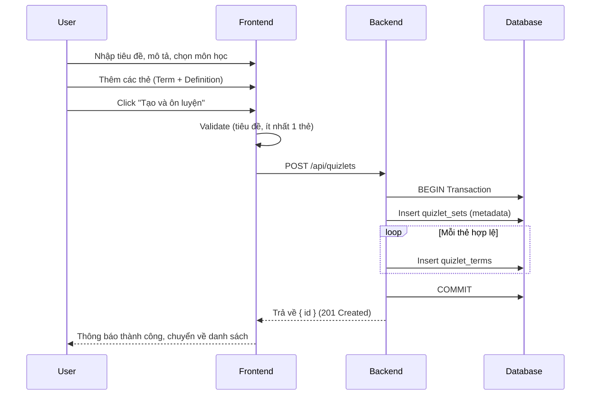
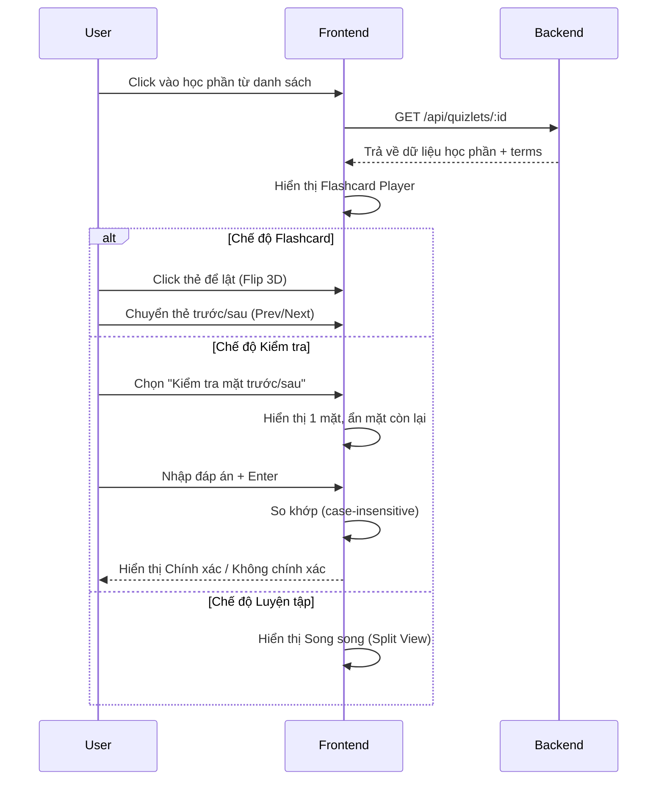
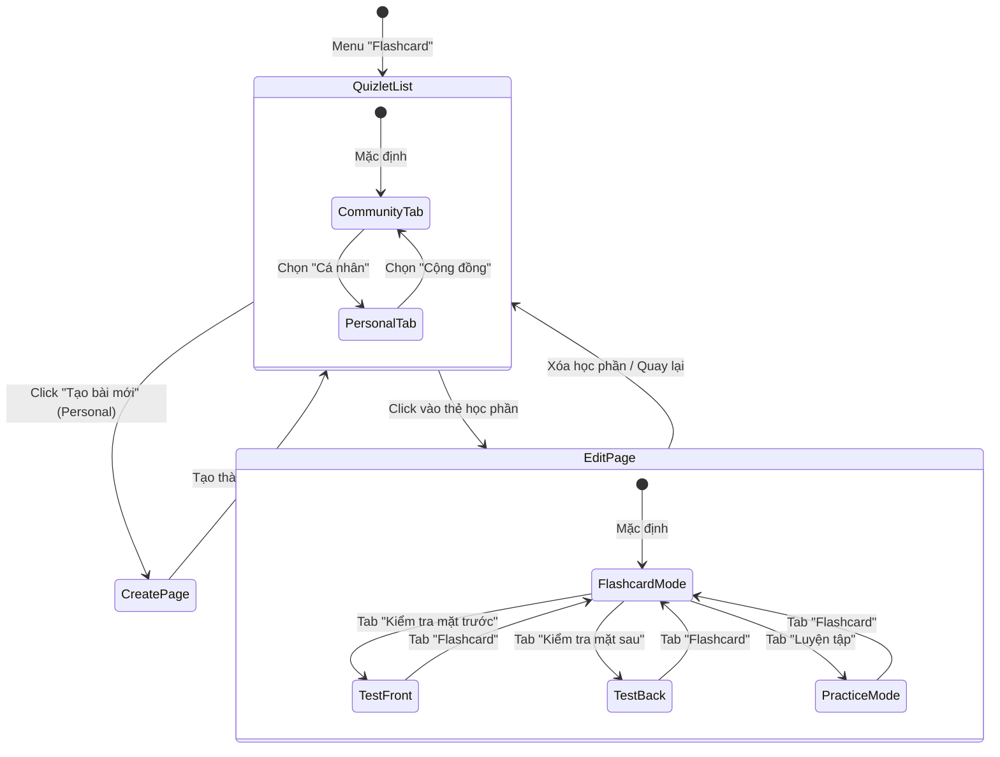

# Thiết kế chi tiết - Chức năng Flashcard (Detail Design - Quizlet)

Tài liệu này mô tả chi tiết thiết kế cho hệ thống quản lý và ôn luyện Flashcard (Học phần) trong ứng dụng **Smart Learn**.

## 1. Danh sách các hạng mục (Features List)

| STT | Hạng mục | Mô tả |
| :-- | :--- | :--- |
| 1 | **Quản lý danh sách học phần** | Hiển thị theo 2 tab: Cá nhân (của tôi) và Cộng đồng (công khai). Nhóm theo Cấp học → Môn học. |
| 2 | **Tạo học phần mới** | Form tạo với: Tiêu đề, Mô tả, Môn học, Cấp độ, Lớp, Chế độ hiển thị (Công khai/Riêng tư). |
| 3 | **Quản lý thẻ (Terms)** | Thêm/Xóa/Sắp xếp từng thẻ với 2 mặt: Thuật ngữ (Term) và Định nghĩa (Definition). Hỗ trợ hình ảnh. |
| 4 | **Import danh sách** | Nhập hàng loạt thuật ngữ từ văn bản (dạng CSV: `thuật ngữ, định nghĩa` mỗi dòng). |
| 5 | **Ôn luyện Flashcard** | Lật thẻ trước/sau với hiệu ứng 3D Flip. Hỗ trợ: Autoplay, Shuffle, Fullscreen. |
| 6 | **Kiểm tra mặt trước** | Hiển thị mặt trước (Thuật ngữ), yêu cầu người dùng nhập Định nghĩa để kiểm tra. |
| 7 | **Kiểm tra mặt sau** | Hiển thị mặt sau (Định nghĩa), yêu cầu người dùng nhập Thuật ngữ để kiểm tra. |
| 8 | **Chế độ Luyện tập** | Hiển thị đồng thời cả 2 mặt của thẻ (Split View) để ôn luyện nhanh. |
| 9 | **Tùy chỉnh giao diện thẻ** | Thay đổi màu chữ và cỡ chữ riêng biệt cho mặt trước và mặt sau từ bảng màu 60+ màu. |
| 10 | **Phân quyền & Tầm nhìn** | Công khai/Riêng tư. Lọc nội dung cộng đồng theo Cấp học (Education Level) của User. |

---

## 2. Danh sách Validate (Validation List)

### 2.1. Tạo/Sửa học phần (Create/Edit Form)
- **Tiêu đề**: Không được để trống.
- **Danh sách thẻ**: Phải có ít nhất 1 thẻ có nội dung (term hoặc definition không trống).
- **Số thẻ tối thiểu**: Giao diện luôn duy trì tối thiểu 2 thẻ (không xóa được khi còn ≤ 2 thẻ).

### 2.2. Import danh sách
- **Định dạng**: Mỗi dòng là 1 thẻ, thuật ngữ và định nghĩa cách nhau bằng dấu phẩy (`,`).
- **Lọc trống**: Các dòng không có cả thuật ngữ lẫn định nghĩa sẽ bị bỏ qua.

### 2.3. Chế độ kiểm tra (Test Mode)
- **So khớp đáp án**: So sánh không phân biệt chữ hoa/thường (case-insensitive), có trim khoảng trắng.

---

## 3. Danh sách Message (Message List)

| Mã lỗi/Trạng thái | Nội dung thông báo (Tiếng Việt) |
| :--- | :--- |
| **Create Success** | "Đã tạo học phần thành công!" |
| **Save Success** | "Đã lưu thành công!" |
| **Delete Confirm** | "Bạn có chắc chắn muốn xóa học phần này?" / "Xóa học phần này?" |
| **Delete Success** | "Đã xóa!" / "Đã xóa học phần" |
| **Title Required** | "Vui lòng nhập tiêu đề" / "Nhập tiêu đề" |
| **Terms Required** | "Vui lòng nhập ít nhất một thuật ngữ" / "Nhập ít nhất một thẻ" |
| **Min Cards** | "Cần ít nhất 2 thẻ" |
| **Import Success** | "Đã nhập [N] thẻ" |
| **Import Fail** | "Không tìm thấy dữ liệu hợp lệ để nhập" |
| **Test Correct** | "Chính Xác" |
| **Test Incorrect** | "Không chính xác" |

---

## 4. Danh sách API (API Endpoints)

| Method | Endpoint | Mô tả |
| :--- | :--- | :--- |
| `GET` | `/api/quizlets` | Lấy danh sách học phần (Filter theo User, Public, Admin). Kèm `term_count`, `author_name`, `subject_name`. |
| `GET` | `/api/quizlets/:id` | Lấy chi tiết học phần bao gồm danh sách `terms` (thuật ngữ). |
| `POST` | `/api/quizlets` | Tạo học phần mới (Transaction: Insert `quizlet_sets` + Insert các `quizlet_terms`). |
| `PUT` | `/api/quizlets/:id` | Cập nhật học phần (Transaction: Update metadata + Xóa terms cũ + Insert terms mới). |
| `DELETE` | `/api/quizlets/:id` | Xóa học phần và toàn bộ terms liên quan. |

---

## 5. Flow Diagram (Luồng chức năng)

### 5.1. Luồng Tạo học phần mới

### 5.2. Luồng Ôn luyện Flashcard

### 5.3. Luồng liên kết giữa các màn hình (Navigation Flow)

---

## 6. Case sử dụng (Usecases)

### UC-01: Giáo viên tạo bộ từ vựng cho học sinh
- **Actor**: Giáo viên (Teacher).
- **Mô tả**: Tạo bộ Flashcard từ vựng Tiếng Anh cho lớp 4 và đặt ở chế độ Công khai.
- **Hành động**: Sử dụng Import danh sách để nhập nhanh hàng loạt từ vựng, chọn Cấp độ "Tiểu học" và Môn học phù hợp.
- **Kết quả**: Học sinh cùng cấp học sẽ thấy bộ thẻ trong tab Cộng đồng.

### UC-02: Học sinh ôn luyện từ vựng
- **Actor**: Học sinh (User).
- **Mô tả**: Tìm bộ thẻ trong tab Cộng đồng, lật thẻ để học thuộc, sau đó tự kiểm tra.
- **Hành động**: Sử dụng chế độ Flashcard để ghi nhớ → Chuyển sang Kiểm tra mặt trước để tự đánh giá.
- **Kết quả**: Biết được từ nào đã thuộc (Chính xác) và từ nào cần ôn thêm (Không chính xác).

### UC-03: Người dùng tùy chỉnh giao diện thẻ
- **Actor**: Người dùng bất kỳ (Owner).
- **Mô tả**: Muốn phân biệt rõ mặt trước (Thuật ngữ) và mặt sau (Định nghĩa) bằng màu sắc khác nhau.
- **Hành động**: Mở Settings → Chọn màu đỏ cho mặt trước, xanh cho mặt sau, cỡ chữ 48px.
- **Kết quả**: Thẻ hiển thị đúng theo cấu hình đã chọn trong suốt phiên ôn luyện.
