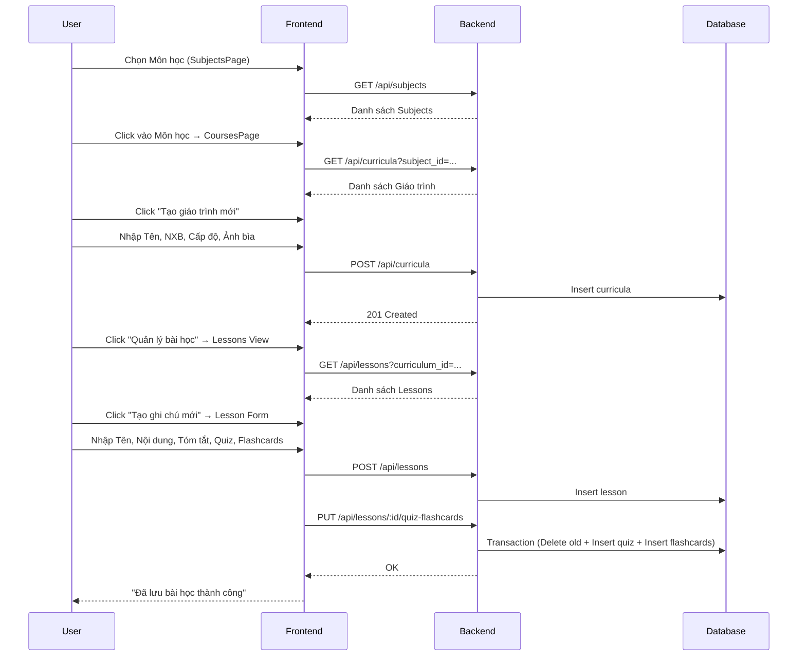
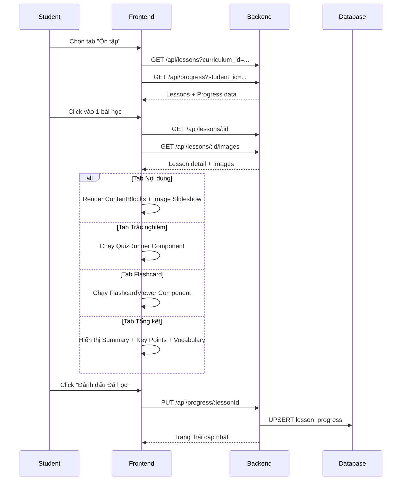
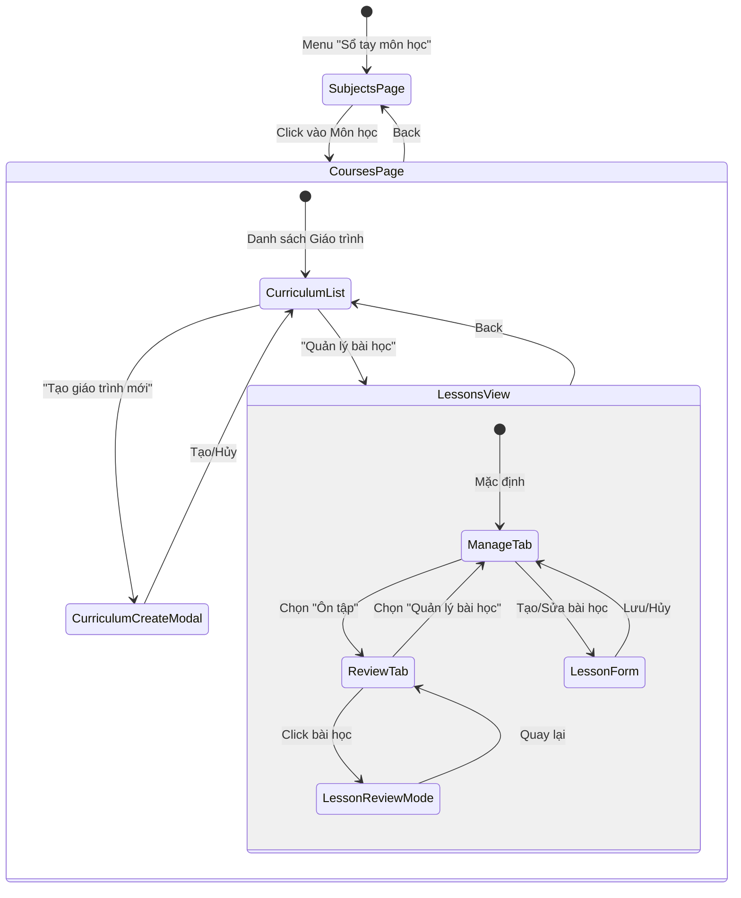
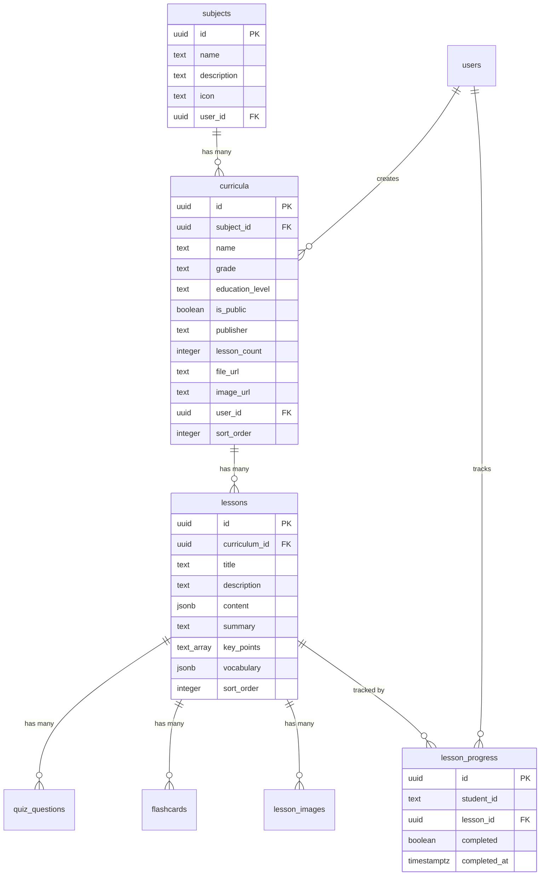

# Thiết kế chi tiết - Chức năng Sổ tay Học tập (Detail Design - Study)

Tài liệu này mô tả chi tiết thiết kế cho hệ thống điều hướng nội dung học tập (Subjects → Curricula → Lessons) trong ứng dụng **Smart Learn**.

## 1. Danh sách các hạng mục (Features List)

| STT | Hạng mục | Mô tả |
| :-- | :--- | :--- |
| 1 | **Danh sách Môn học (Subjects)** | Hiển thị các môn học có sẵn, đếm số giáo trình của User trong mỗi môn. |
| 2 | **Quản lý Giáo trình (Curricula)** | CRUD giáo trình trong mỗi môn học: Tên, NXB, Cấp độ, Lớp, Ảnh bìa, Chế độ hiển thị. Nhóm theo Cấp học. |
| 3 | **Quản lý Bài học (Lessons)** | Tạo/Sửa/Xóa bài học trong giáo trình. Mỗi bài gồm: Nội dung, Mô tả, Tóm tắt, Điểm cần nhớ. |
| 4 | **Trắc nghiệm Bài học (Quiz)** | Thêm câu hỏi trắc nghiệm (4 phương án) kèm giải thích vào mỗi bài học. |
| 5 | **Flashcard Bài học** | Thêm thẻ ghi nhớ (Mặt trước/Mặt sau) vào mỗi bài học. Hỗ trợ Import hàng loạt. |
| 6 | **Hình ảnh Slide** | Upload nhiều hình ảnh cho bài học. Hiển thị dạng Slideshow với thumbnail khi ôn tập. |
| 7 | **Chế độ Ôn tập (Review Mode)** | Giao diện ôn tập Tabbed: Nội dung, Trắc nghiệm, Flashcard, Tổng kết. |
| 8 | **Theo dõi Tiến độ (Progress)** | Đánh dấu "Đã học" cho từng bài. Hiển thị trạng thái hoàn thành trên danh sách. |
| 9 | **Sắp xếp thứ tự** | Sắp xếp lại thứ tự giáo trình (Reorder) bằng API riêng. |

---

## 2. Danh sách Validate (Validation List)

### 2.1. Môn học (Subjects) — Chỉ Admin
- **Tên môn học**: Không được để trống.

### 2.2. Giáo trình (Curricula)
- **Môn học (subject_id)**: Bắt buộc.
- **Tên giáo trình**: Không được để trống.
- **Phân quyền**: Chỉ Owner hoặc Admin mới được Sửa/Xóa giáo trình.

### 2.3. Bài học (Lessons)
- **Giáo trình (curriculum_id)**: Bắt buộc.
- **Tên bài học**: Không được để trống.
- **Nội dung**: Mỗi dòng được chuyển thành 1 đoạn (paragraph block).

### 2.4. Trắc nghiệm Bài học
- **Câu hỏi**: Phải có nội dung.
- **Phương án**: Phải có ít nhất 2 phương án không trống.
- **Đáp án đúng (correctIndex)**: Phải là số hợp lệ (mặc định 0).

### 2.5. Flashcard Bài học
- **Mặt trước (front)** và **Mặt sau (back)**: Cả hai phải có nội dung (không trống sau khi trim).

### 2.6. Hình ảnh
- **Upload**: Chỉ cho phép khi bài học đã được lưu (có `editingLessonId`).
- **Định dạng**: Chấp nhận file ảnh (`image/*`), tối đa 20 file mỗi lần upload.

---

## 3. Danh sách Message (Message List)

| Mã lỗi/Trạng thái | Nội dung thông báo (Tiếng Việt) |
| :--- | :--- |
| **Curriculum Delete Confirm** | "Xóa giáo trình này? Toàn bộ bài học trong giáo trình sẽ bị xóa." |
| **Curriculum Delete Success** | "Đã xóa giáo trình" |
| **Curriculum Delete Fail** | "Không thể xóa giáo trình" |
| **Lesson Save Success** | "Đã lưu bài học thành công" |
| **Lesson Save Fail** | "Không thể lưu bài học. Vui lòng thử lại." |
| **Lesson Title Required** | "Vui lòng nhập tên bài học" |
| **Lesson Delete Confirm** | "Xóa bài học này? Mọi dữ liệu trắc nghiệm và flashcard liên quan sẽ bị xóa." |
| **Lesson Delete Success** | "Đã xóa bài học" |
| **Lesson Delete Fail** | "Không thể xóa bài học" |
| **Image Upload Success** | "Đã tải ảnh lên" |
| **Image Upload Fail** | "Không thể tải ảnh lên" |
| **Image Delete Confirm** | "Xóa hình ảnh này?" |
| **Image Delete Success** | "Đã xóa ảnh" |
| **Image Delete Fail** | "Không thể xóa ảnh" |
| **Flashcard Import Success** | "Đã nhập [N] thẻ" |

---

## 4. Danh sách API (API Endpoints)

### 4.1. Subjects (Môn học)

| Method | Endpoint | Mô tả |
| :--- | :--- | :--- |
| `GET` | `/api/subjects` | Lấy danh sách tất cả môn học. |
| `GET` | `/api/subjects/:id` | Lấy chi tiết 1 môn học. |
| `POST` | `/api/subjects` | Tạo môn học mới (**Admin only**). |
| `PUT` | `/api/subjects/:id` | Cập nhật môn học (**Admin only**). |
| `DELETE` | `/api/subjects/:id` | Xóa môn học (**Admin only**). |
| `POST` | `/api/subjects/reorder` | Sắp xếp lại thứ tự môn học (**Admin only**). |

### 4.2. Curricula (Giáo trình)

| Method | Endpoint | Mô tả |
| :--- | :--- | :--- |
| `GET` | `/api/curricula?subject_id=...` | Lấy danh sách giáo trình theo môn học. Kèm `lesson_count`, `authorName`. |
| `GET` | `/api/curricula/:id` | Lấy chi tiết giáo trình. |
| `POST` | `/api/curricula` | Tạo giáo trình mới (hỗ trợ upload file đính kèm). |
| `PUT` | `/api/curricula/:id` | Cập nhật giáo trình (**Owner/Admin**). |
| `DELETE` | `/api/curricula/:id` | Xóa giáo trình và toàn bộ bài học bên trong (**Owner/Admin**, CASCADE). |
| `POST` | `/api/curricula/reorder` | Sắp xếp lại thứ tự giáo trình. |

### 4.3. Lessons (Bài học)

| Method | Endpoint | Mô tả |
| :--- | :--- | :--- |
| `GET` | `/api/lessons?curriculum_id=...` | Lấy danh sách bài học theo giáo trình. Kèm `quiz` và `flashcards` (JSON aggregation). |
| `GET` | `/api/lessons/:id` | Lấy chi tiết bài học (bao gồm quiz + flashcards). |
| `POST` | `/api/lessons` | Tạo bài học mới. |
| `PUT` | `/api/lessons/:id` | Cập nhật nội dung bài học. |
| `DELETE` | `/api/lessons/:id` | Xóa bài học (CASCADE: quiz_questions, flashcards, lesson_images). |
| `PUT` | `/api/lessons/:id/quiz-flashcards` | Ghi đè toàn bộ quiz + flashcards của bài học (Transaction). |

### 4.4. Lesson Images (Hình ảnh Bài học)

| Method | Endpoint | Mô tả |
| :--- | :--- | :--- |
| `GET` | `/api/lessons/:id/images` | Lấy danh sách hình ảnh của bài học. |
| `POST` | `/api/lessons/:id/images` | Upload hình ảnh (multipart, tối đa 20 file). |
| `DELETE` | `/api/lessons/:id/images/:imageId` | Xóa 1 hình ảnh (xóa cả file trên disk). |

### 4.5. Progress (Tiến độ)

| Method | Endpoint | Mô tả |
| :--- | :--- | :--- |
| `GET` | `/api/progress?student_id=...` | Lấy tiến độ học tập của User. |
| `PUT` | `/api/progress/:lessonId` | Đánh dấu/Bỏ đánh dấu "Đã học" (UPSERT). |

---

## 5. Flow Diagram (Luồng chức năng)

### 5.1. Luồng Tạo nội dung học tập

### 5.2. Luồng Ôn tập bài học

### 5.3. Luồng liên kết giữa các màn hình (Navigation Flow)

---

## 6. Database Schema

### 6.1. Quan hệ giữa các bảng

---

## 7. Case sử dụng (Usecases)

### UC-01: Giáo viên tạo giáo trình và bài học
- **Actor**: Giáo viên (Teacher).
- **Mô tả**: Tạo giáo trình "Ngữ văn 7" thuộc môn Ngữ văn, sau đó thêm các bài học có nội dung ghi chú, trắc nghiệm ôn tập, và flashcard từ vựng.
- **Hành động**: Chọn Môn Ngữ văn → Tạo Giáo trình → Quản lý bài học → Tạo ghi chú mới → Nhập nội dung + Quiz + Flashcards → Lưu.
- **Kết quả**: Giáo trình hiển thị trong danh sách cá nhân, sẵn sàng để ôn tập.

### UC-02: Học sinh ôn tập nội dung bài học
- **Actor**: Học sinh (User).
- **Mô tả**: Mở giáo trình đã tạo, chuyển sang tab "Ôn tập" để học lại nội dung, làm quiz, và lật flashcards.
- **Hành động**: Chọn Giáo trình → Tab "Ôn tập" → Chọn bài học → Xem slide ảnh → Chuyển tab Quiz → Làm trắc nghiệm → Đánh dấu "Đã học".
- **Kết quả**: Bài học được đánh dấu hoàn thành (hiện badge "Đã học" màu xanh).

### UC-03: Thêm hình ảnh Slide vào bài học
- **Actor**: Người dùng (Owner).
- **Mô tả**: Upload ảnh chụp bảng, slide bài giảng vào bài học để tiện ôn tập.
- **Hành động**: Sửa bài học → Phần "Hình ảnh bài học" → Click "Thêm ảnh" → Chọn nhiều file → Upload.
- **Kết quả**: Ảnh hiển thị dạng Slideshow khi ôn tập, có thanh thumbnail để chuyển nhanh.

### UC-04: Import Flashcard hàng loạt
- **Actor**: Người dùng bất kỳ (Owner).
- **Mô tả**: Nhập nhanh danh sách từ vựng từ văn bản có cấu trúc CSV vào flashcards của bài học.
- **Hành động**: Tại form bài học → Click "Nhập danh sách" → Dán nội dung `thuật ngữ, định nghĩa` → Nhập ngay.
- **Kết quả**: Các thẻ flashcard được thêm vào cuối danh sách hiện có.
